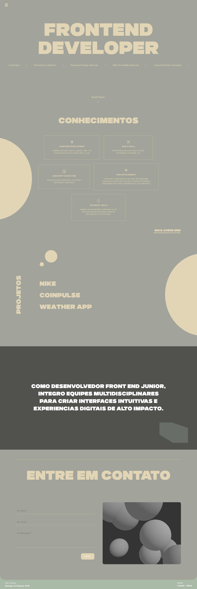
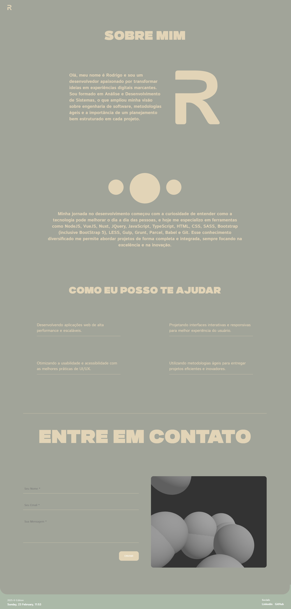

<h1 align="center">
  Portfólio 
</h1>

O Developer Portfolio é uma aplicação Nuxt.js que exibe meus projetos, habilidades e trajetória profissional de maneira interativa e dinâmica. A aplicação integra animações sofisticadas com GSAP, efeitos 3D com Three.js e uma interface responsiva para oferecer uma experiência imersiva ao usuário. Ela permite explorar seções como Projetos, Expertise, Serviços e Contato, proporcionando uma visão completa do meu trabalho e das minhas competências.

<p align="center">
  
</p>

## 💻 Visão Geral

O Developer Portfolio é uma aplicação web desenvolvida para fornecer uma visão detalhada e precisa dos meus projetos, habilidades e experiências profissionais. Ela permite que os usuários explorem seções interativas sobre os projetos realizados, habilidades técnicas, serviços oferecidos e formas de contato. O portfólio usa APIs para fornecer funcionamento dinâmico e responsivo, com uma interface intuitiva que facilita a navegação e compreensão das informações. Além disso, a aplicação integra animações sofisticadas usando **GSAP** e gráficos interativos com **Three.js**, proporcionando uma experiência visualmente envolvente para destacar meu trabalho. O portfólio inclui diversas seções, como **Projetos**, **Expertise**, **Serviços** e **Contato**, e se adapta automaticamente aos tamanhos de tela de diferentes dispositivos.

<p align="center">
  
</p>

## ⚙️ Funcionalidades

- **Visualização de Projetos:** Explore meus projetos com detalhes, conhecendo as tecnologias utilizadas e acessando links para demos e repositórios.
- **Exposição de Expertise:** Navegue pela seção de expertise para conferir minhas principais habilidades e experiências em desenvolvimento web.
- **Serviços de Desenvolvimento:** Descubra como posso transformar ideias em soluções web modernas e eficientes.
- **Interatividade Avançada:** Desfrute de animações dinâmicas com GSAP e efeitos 3D interativos implementados com Three.js.
- **Contato Simplificado:** Utilize um formulário responsivo e validado para enviar mensagens e solicitar mais informações.

## 🛠️ Tecnologias

Aqui estão as principais tecnologias utilizadas neste projeto:

- **Nuxt.js & Vue.js:** Frameworks para construção da interface de usuário e gerenciamento de rotas.
- **GSAP:** Biblioteca para animações dinâmicas e interativas.
- **Three.js:** Renderização de gráficos 3D para experiências imersivas.
- **Axios:** Cliente HTTP para requisições de dados.
- **SCSS:** Pré-processador CSS para estilos organizados e responsivos.
- **Conventional Commits:** Para manter um histórico de commits claro e consistente.

<br>

# 🛠️ Instalação

### Requisitos

- Node.js (versão 14 ou superior)
- npm (versão 6 ou superior)

### Passos

1. **Clone o repositório:**

```sh
git clone https://github.com/RodrigoRodrigues-Dev/rodrigo.dev.git

cd rodrigo.dev
```

2. **Instale as dependências:**

```sh
npm install
```
<br>

# 🚀 Uso
Para iniciar a aplicação em modo de desenvolvimento, execute:

```sh
npm run dev
```
Para construir o projeto para produção, utilize:

```sh
npm run build
```
<br>

## 📃 Licença
Este projeto está licenciado sob a Licença MIT - veja o arquivo [LICENSE](LICENSE) para mais detalhes.
<br>

## ☎️ Contato
Desenvolvido por [Rodrigo Rodrigues](https://github.com/RodrigoRodrigues-Dev). Entre em contato por 📧 [rodrigorodriguesdevcontato@gmail.com](mailto:rodrigorodriguesdevcontato@gmail.com)